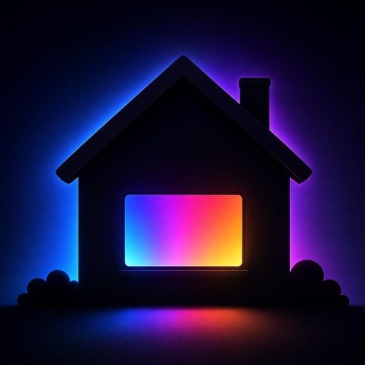

# RGBroadcast

<p align="center">
  
</p>

[](https://github.com/SiteRelEnby/RGBroadcast/releases)
[](https://github.com/SiteRelEnby/RGBroadcast/actions)


Make a light look like a television is on, so an empty house looks occupied.

Occupancy simulation usually replays recorded on/off history, or blinks lights
on a timer. Neither looks like the one thing that most says "someone is home" to
anyone watching from outside: the flickering, colour-shifting glow of a screen.
RGBroadcast drives any controllable light to produce that glow, with distinct
content styles (film, news, sport, and so on) and broadcast-style ad breaks, so
an evening looks like a person watching television rather than a script running.

It pairs well with a conventional presence simulation such as
[`presence_simulation`](https://github.com/slashback100/presence_simulation):
let that handle the rest of the house, and let RGBroadcast handle the living room.

## What it does

- **Works on almost any light.** It auto-detects what your light can do (full
  colour, colour temperature, brightness only) and degrades gracefully. There is
  no "what kind of light is this" question to answer.
- **Random walk, not random flicker.** Consecutive states are related, so it
  reads as a screen rather than a disco. Brightness variation, the strongest cue
  through a curtain, does most of the work.
- **Content styles.** `film`, `news`, `sport`, `action`, `game`, `latenight`,
  plus a `schedule` that rotates through the evening with nightly randomisation
  so no two nights match.
- **Ad breaks.** Broadcast-style breaks every 12 to 18 minutes: a couple of
  minutes of brighter, faster, more saturated output, which is a distinctive
  tell of live television.
- **Coordinated multiple lights.** One "screen" light does the full swing; extra
  "spill" lights are lit as if by it, staying dimmer and trailing its colour, so
  a room with a lamp beside the telly looks right.
- **Live control.** Style, intensity and ad breaks are entities, so you can
  adjust them from a dashboard or an automation while the simulation is running,
  without a reload.

## Installation

### Via HACS (custom repository)

1. In HACS, choose **Custom repositories**.
2. Add `https://github.com/SiteRelEnby/rgbroadcast` with category **Integration**.
3. Install **RGBroadcast**, then restart Home Assistant.

### Manual

Copy `custom_components/rgbroadcast` into your Home Assistant `config/custom_components`
directory and restart.

## Setup

1. **Settings → Devices & services → Add integration → RGBroadcast.**
2. Pick a **screen light** (the main one). Optionally add **spill lights**.
3. That creates a device with these entities:

   | Entity | What it does |
   |---|---|
   | `switch.<name>` | Runs the simulation while on. |
   | `select.<name>_style` | Content style, or `schedule`. |
   | `number.<name>_intensity` | 0.5 to 2.0. The single realism dial. |
   | `switch.<name>_ad_breaks` | Enable broadcast-style ad breaks. |
   | `binary_sensor.<name>_ad_break` | On during an ad break (diagnostic). |

Turn the main switch on and watch the light. To tune it, put the intensity
slider on a dashboard, watch the light through the curtain from outside, and
adjust live.

## Important: exclude the light from Recorder

Running for a few hours produces well over a thousand state changes per hour per
light, each carrying full colour attributes, for history that has no analytical
value. **Exclude the driven lights from Recorder**, or your database will grow
fast:

```yaml
# configuration.yaml
recorder:
  exclude:
    entities:
      - light.living_room_lamp
```

RGBroadcast already suppresses back-to-back identical commands, but the effect is
inherently chatty by design. This is the one bit of manual configuration worth
not skipping.

## If your light snaps instead of fading

Some lights, **Matter lights especially**, report that they support smooth
transitions and then jump instantly instead. Home Assistant has no way to know
this in advance, and there is no software fallback: the transition is sent and
silently ignored.

If your light looks steppy or jumpy where it should be smooth, turn on **Force
stepped rendering** in the integration's options. RGBroadcast will then drive it
with frequent small changes instead of relying on the device to interpolate,
which looks smooth on a light that lies about transitions.

The other options there:

- **Force capability tier** for a light that misreports what it can do.
- **Never use colour temperature** to keep a colour-capable light on RGB.
- **Brightness ceiling** to scale everything down for a dim room.
- **Minimum / maximum update interval** if the light falls behind (raise the
  minimum) or you want it calmer.
- **When stopped**: fade out and turn off, or restore the light's previous state.

## How it decides what your light can do

| Tier | Light has | Behaviour |
|---|---|---|
| Hybrid | colour and colour temperature | Colour temperature for pale scenes, colour for vivid ones |
| Colour | colour only | Hue, saturation and brightness |
| Colour temp | colour temperature only | Warm/cool white and brightness |
| Brightness | dimmable only | Brightness only, still surprisingly convincing |
| On/off | neither | Cannot be simulated; setup will tell you |

## Development

```bash
python -m venv .venv
.venv/bin/pip install -r requirements-test.txt
.venv/bin/pytest
.venv/bin/ruff check custom_components tests
```

The visual logic (`walk.py`, `renderer.py`, `schedule.py`) is pure Python with
no Home Assistant dependency, so the realism model is tested exhaustively without
a running instance. See `tests/`.

## Licence

MIT. See [LICENSE](LICENSE).
